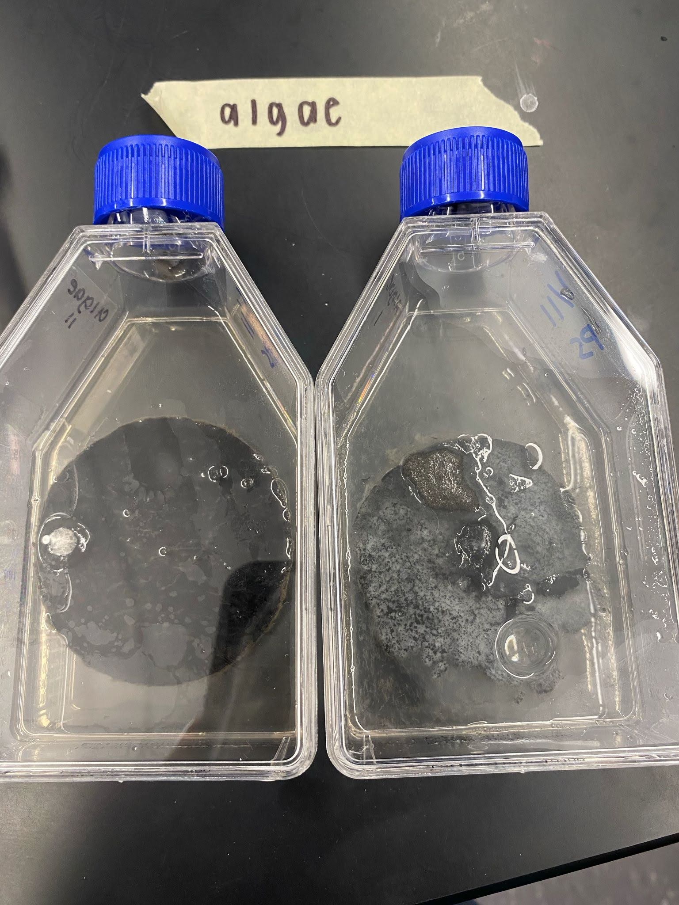
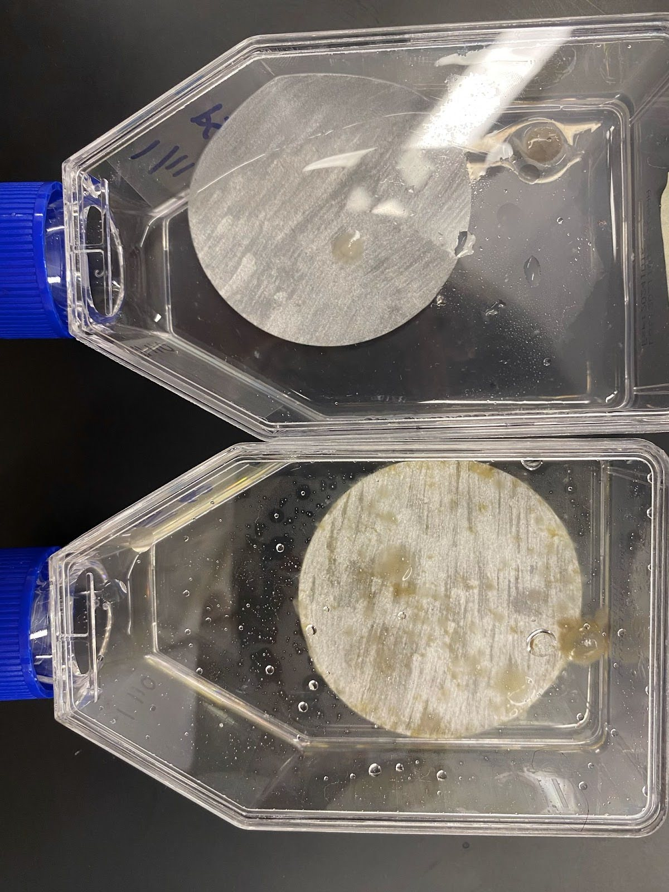

+++ { "part": "first_page" }

## Introduction
Cellulosic waste is becoming more and more of a global problem. Organic components of cellulosic wastes include paper, tissue, filters, fabric, and wood {cite:p}`https://doi.org/10.1016/s0144-8617(02)00183-2`. Cellulose’s abundance and commercial availability make it a common raw material used in producing many commodities. Unfortunately, much of the waste from these goods is often disposed of through burning biomass, which is not restricted to developing countries alone but is considered a global phenomenon {cite:p}`https://doi.org/10.1155/2012/578925`. Agricultural and industrial wastes are some of the leading causes of environmental pollution. Proper biotechnological utilization of these wastes will eliminate their pollution and turn them into useful by-products {cite:p}`https://doi.org/10.9790/3008-0641720 `. Due to the massive applicability of cellulase, it has been used in various industrial processes such as the production of biofuels – like bioethanol {cite:p}`https://doi.org/10.1155/2012/578925`. Cellulose is a linear polymer of glucose residues connected by β-1, 4-glycosidic bonds. Cellulose degradation is accomplished by "cellulases," which are the enzymes that hydrolyze the β-1,4-linkages found in cellulose {cite:p}`https://doi.org/10.1155/2012/578925`. Cellulose breaks down into glucose by a very specialized process called depolymerization, which only requires a small number of saprophytes {cite:p}`https://doi.org/10.1016/0143-1471(81)90100-8`. However, the degradation rates can be affected when ink comes into contact with cellulose, whether on a box or paper packaging. Biodegradation of cellulose is significant, and it is proven that the degradation rate is negatively affected by petroleum ink. The most crucial worldwide issue now is environmental pollution caused by petroleum and petrochemical goods. Ecological life is severely harmed by these waste emissions derived from petroleum {cite:p}`https://doi.org/10.1007/s13399-023-05101-z`. Due to this issue and the goal of reducing pollution, sustainability, and waste reduction, many companies have invented and used water, algae, alcohol, and many other types of inks. Making sure that the majority of the ingredients utilized in the formulation

+++

are biobased, biodegradable, or do not qualify as crucial raw resources is essential to producing sustainable inks {cite:p}`https://doi.org/10.3390/ma16113940`. 

Cellulases produced by fungi and bacteria play the most important microscopic role in the breakdown of cellulose. High-yield cellulose-degrading bacteria are environmentally friendly, inexpensive, convenient, and do not cause secondary pollution. Several studies have shown that these functional bacteria isolated from cellulose-rich waste environments can considerably accelerate the degradation of cellulose, improve the conversion efficiency of agricultural waste composting, and speed up the process of composting. Studying their ability to produce enzymes and degrade cellulose will help to find high-quality strains that can efficiently break down cellulose {cite:p}`https://doi.org/10.1038/s41467-023-41172-2 `. 

When the first black ink made from algae was invented by two molecular biology Ph.D. candidates at Colorado State University, they were studying biofuels and bioproducts. They later founded Living Ink Technologies, which makes Algae Black– a greener pigment substitute for carbon black made from petroleum. Algae-based inks, which have no volatile organic compounds and are renewable and biodegradable, are thought to be the most sustainable. Water-based inks, when applied in flexography and gravure printing, contain up to 60% volatile organic compounds. The benefits of this liquidity are now the main focus of environmental conservation initiatives {cite:p}`https://doi.org/10.1007/978-94-009-1547-3 `. Alcohol-based inks are considered environmentally sustainable due to their lower levels of volatile organic compounds, biodegradability, and often lower toxicity. Some formulations use ethanol derived from renewable resources, contributing to a reduced environmental impact. Additionally, the energy efficiency of production processes further enhances the overall sustainability of alcohol-based inks {cite:p}`https://doi.org/10.1007/978-94-009-1547-3 `. Oil-based inks can be environmentally harmful due to petroleum-based solvents, high Volatile organic compounds (VOC) levels, including toluene, benzene, and xylene, and the environmental impact of petroleum extraction (*psprint.com*). Along with the algae ink, water-based ink, alcohol-based ink, and oil-based ink, this study also included a control variable that had no ink on the filter paper.

However, the larger question is whether these new inks are efficient in progressing the biodegradability of cellulose (in the form of filter paper). Do they hinder its biodegradability? By answering these questions, we can measure to what extent the environment will be affected by the type of ink. This study explores whether the type of ink significantly correlates with the biodegradability of our cellulose substrate in the presence of Pseudopithomyces fungus found here in Burke County. 

## Methods

### Cellulose Substrates and Inks
Whatman 1 Filter paper which has a diameter of 70 mm was used as the cellulose substrate. Four inks were used in this experiment. Water-based ink came from SiegWerk Environmental Inks. Oil-based ink came from Painters Opaque Paint Markers. Algae-based ink was acquired from EcoEnclose and developed by Living Ink Technologies. Lastly, alcohol-based ink came from a standard black permanent Sharpie marker. 

### Preparation of Experimental Setup
The four different inks were applied to each substrate piece, and one piece was left blank to use as the control. It ensured that each piece of filter paper was fully covered with ink. The algae ink was applied onto the substrate by smearing it with gloves. The water-based ink was applied using an Anilox hand ink roller. This was done twice, which resulted in a total of ten samples. 10 Fisher Brand 75cm^2 vented cap culture flasks were obtained and each was filled with 30 ml of clear Miracle Grow solution. The plates of the unidentified Burke County fungal cultures were obtained. A 1000 ml pipette tip was used to puncture a hole in the agar of the fungal plate, and a sterile wooden stick was used to place the cut fungal sample into the culture flask. This was repeated ten times, for each culture flask. Each substrate was then placed into its labeled flask. A sterile plastic loop was used to adjust the substrate and flatten it, so it was completely submerged in the Miracle Grow. 

### Biodegradation Experiment
Different experimental groups were used for this experiment. The ink for each test group was acquired from the aforementioned sources listed above. Each filter paper (cellulose) was treated with a distinct ink type; this resulted in ten samples. Approximately one layer of ink was applied to the filter paper.

### Analytical Technique
To quantify the degradation of the filter paper and how it varied within each of the experimental groups, a Vernier Go Direct SpectroVis Plus spectrophotometer was used. The spectrophotometer was used in each respective solution to measure the absorbance of light based on how dark in color it was. Seven cuvettes, one 15 mL conical tube, 1.5 mM Substrate (p-nitrophenol), Resuspension Buffer, Stop Solution, and the enzyme were gathered. One out of the ten samples from the experiment was chosen to serve as the enzyme for each spectrophotometer trial. The conical tube was labeled “Enzyme Reaction”. Five of the cuvettes were labeled E1-E5. The remaining two cuvettes were labeled “Start” and “End”. 500 uL of stop solution was pipetted into each cuvette. Three mL of 1.5 mM Substrate was pipetted into the enzyme reaction tube. 250 uL of the enzyme extract sample was pipetted into the enzyme reaction tube. The timer was started. 500 uL was pipetted out of the enzyme reaction tube and into the cuvettes labeled E1-E5 in designated increments (E1 at 1 minute, E2 at 2 minutes, E3 at 4 minutes, E4 at 6 minutes, and E5 at 8 minutes). 500 uL of suspension buffer was added to the sixth cuvette as well as a drop of the enzyme sample to be used as a blank for the experiment. This was used to calibrate the spectrophotometer before measuring the absorbance. In order to find the absorbance levels for the spectrophotometer the Beer-Lambert law was used. This law describes the relationship between the concentration of an analyte in a solution and the amount of light it absorbs. This relationship is formulated as A = εbc, where A represents the absorbance of light by the solution, ε denotes the molar absorptivity of the analyte, b is the path length (the length of the solution through which the light passes), and c stands for the analyte's concentration. By doing a spectral scan, we found that at 415 nm, the absorbance was the highest therefore, we stuck with that absorbency. Each cuvette (E1-E5) was carefully wiped down with a KimWipe before being placed in the spectrophotometer. This was repeated for each of the other four cuvettes. This entire procedure was then repeated using each of the other nine samples. Google Sheets was used to record the data collected from the spectrophotometer. GraphPad Prism software was used to analyze the data. 

## Results
In order to measure the degradation of the substrate in the 10 samples, an enzyme assay was performed and the results were measured using a spectrophotometer. Given that there were two samples of each experimental group, it was expected for both samples to be relatively similar to each other in terms of how much they degraded. Some of the results produced held true to that belief while others did not. 

```{figure}  
:label: figure1





Degraded samples (replicate 1): control
``` 

Visual examination of the results revealed (shown in @figure1) that algae ink and water-ink treated substrates were very degraded. However, one of the algae ink samples was more degraded than the other. Algae 1’s filter paper had lost its original circular shape and had fungal growth on its surface. Algae 2’s filter paper was still mostly circular, yet it also had extensive fungal growth on its surface and appeared to have extreme deterioration. Water 1 filter paper was extremely degraded, having turned a yellowish-brown color from the surface fungal growth. It lost much of its original surface area and had holes that the fungus had eaten. Water 2’s filter paper also had a brownish-yellow color with its surface entirely covered in fungal growth, but it had more of its original surface area remaining. Control 1 and 2 filter papers were visibly less degraded than the algae and water-based ink samples, yet they both had a beige color from fungal growth. Contrastingly, the oil-based inks were the least degraded. The original silver color of the filter papers of Oil 1 and 2 was still visible and the paper seemed to maintain its original thickness and shape. Interestingly, Oil 1 had some fungal growth on the surface while Oil 2 did not. Alcohol 1 and 2 filter papers did not appear to have much growth on the surface or degradation.

:::{table} All values obtained from spectrophotometer for each enzyme for each enzyme assay performed (one done for each sample) at 415 nm
:label: spectrophotometer_data
:align: center

| Time Elapsed (in min)  | Water 1 |  Water 2 | Control 1 | Control 2| Oil 1|Oil 2 | Alcohol 1| Alcohol 2|Algae 1|Algae 2|Miracle Gro|
|---|---|---|---|---|---|---|---|---|---|---|---|
|   1     |   0.698   | 0.468     |  0.455   |0.725| 0.582| 0.521| 0.622|0.478| 0.746|0.601| 0.477|
|   2    |    0.684    | 0.664     |    0.545    | 0.712| 0.6| 0.545| 0.637|0.554| 0.781|0.629| 0.486|
|  4     |    0.737    | 0.731     |    0.49    | 0.766| 0.65| 0.562| 0.642|0.568| 0.877|0.691| 0.44|
|  6    |    0.851    | 0.782     |    0.538    | 0.765| 0.648| 0.535| 0.655|0.575| 1.023|0.727| 0.468|
|  8    |    0.858    | 0.853     |    0.588    | 0.807| 0.699| 0.57| 0.663|0.569| 1.12|0.83| 0.502|
:::

Further steps were taken to analyze and learn more about the visual notes that were made. As mentioned in the methods section, an enzyme assay was conducted. Our results were measured by how yellow it turned when the p-nitrophenol (1.5 mM substrate) came into contact with the stop solution, thus showing how active the enzyme was. By receiving spectrophotometer results and quantifying the intensity of the yellow color produced in the cuvette samples, our results were compiled into @spectrophotometer_data. As seen with each of the samples, the value of the spectrophotometer reading of absorbance increased over time meaning that the enzyme activity increased as it degraded the substrate. Miracle-Gro was also run through the enzyme assay on its own to ensure that it as a medium was not accounting for the relatively high starting spectrophotometer readings but rather that it was the enzyme itself. Putting Miracle-Gro into the stop solution at selected intervals did cause a pH-influenced color change with an absorbance range of 0.44-0.502 (as shown in @spectrophotometer_data). Upon graphing this and finding the line of best fit, it was determined that the linear slope was around 0.002 which is very close to zero. All ten samples’ spectrophotometer results were graphed and a line of best fit was made to find the slope (as shown in @sample_absorbance).

:::{table} Slopes of each sample's absorbance found in the Enzyme Assay
:label: sample_absorbance
:align: center

|  Sample      |    Slope (absorbance/min)          |
|   ---      |           ---      |
| Control 1     | 0.0137   |
| Control 2     | 0.0123          |
| Water 1     | 0.0276         |
| Water 2     | 0.0471           |
| Oil 1    |0.0156 |
|Oil 2      | 0.00459           |
| Alcohol 1     |0.00543|
| Alcohol 2     | 0.0102          |
| Algae 1     |0.0554|
| Algae 2  | 0.031         |
:::
After recording the slopes of all ten samples, the average slope of the 1 and 2 samples of each ink type was calculated. These new slopes, adding the slope of Miracle-Gro as well, were visualized in a bar chart (shown in @figure-4). Notably, the average slope of Water was 0.0374 absorbance/min compared to the average slope of Control of 0.0130 absorbance/min. The average slope of Algae was even higher, at 0.0432 absorbance/min. The average absorbance/min of Oil was 0.0101, while Alcohol’s value was even lower at 0.0078. Miracle Gro’s slope was the lowest, as expected, at 0.0020 absorbance/min. The error bars in @figure-4 were calculated using the 95% confidence interval of the standard error. Two-tailed 0.05 significance p-values were also calculated for the slopes of each ink type in relation to the control group. The p-value for Control and Algae was 0.132. The p-value for Control and Water was 0.130. The p-value for Control and Oil was 0.653. The p-value for Control and Alcohol was 0.172. The p-value for Alcohol and Algae, the two extremes of the average slopes, was 0.104. Our p-values showed that the differences seen between ink types were not statistically significant, given our preliminary data. 

```{figure} /images/graph.png
:label: figure-4

Barchart showing the average of the absorbance slopes of samples 1 and 2 of each ink type
``` 

## Discussion
The visual examination of the samples yielded important information about how different types of ink affect the biodegradability of cellulose. Significant degradation of the filter paper was seen in both water-based and algae-based inks, with notable variation between the two samples of algae ink. On the other hand, oil-based and alcohol-based inks exhibited the least amount of degradation, preserving their original look with little fungal development. These qualitative findings could support the theory that the type of ink used affects the biodegradability of cellulose, with oil-based and alcohol-based inks inhibiting degradation if this experiment was replicated with multiple trials. It’s important to consider, however, that the application of the ink to the different filter paper is very hard to control. When applying the alcohol-based ink which was in the form of a Sharpie marker, it was easy to add strips of the ink. This method is much closer to having one layer of ink on the filter paper–which was the goal. However, with other experimental groups such as the algae ink, it was much harder to control the amount of ink that was meant to be on the filter paper since the liquid ink was painted on. This method was uncontrolled and could have had confounding effects on the results. 

While conducting this experiment, questions arose as to whether or not the absorbance values were a result of the enzyme activity or whether the results came from the activity of the medium that was used: Miracle-Gro. Instead of using an enzyme sample in this unplanned experimental group, only a Miracle-Gro solution was used. These results showed a change in color but the increase in absorbance over time was a negligible amount. 

The age of substrate used while performing the enzyme assay was crucial. 1.5 Mm substrate was used and the exact vial that was being used was not initially tracked. There were multiple 1.5 Mm substrate vials, all of varying ages. One of the experiment groups had a different 1.5 Mm substrate used which produced peculiar findings as this 1.5 Mm substrate generated significantly lower readings on the spectrophotometer. Upon realizing this, the new substrate was removed and throughout the rest of the experiment, the older vial was used. Therefore, the sample that led to this finding was discarded. 

The spectrophotometer-assisted enzyme assay produced quantitative data that supported the qualitative observations. As the substrate broke down over time, the absorbance values showed rising enzyme activity, with variances seen among various ink kinds. Calculating the average slopes of absorbance/min for every type of ink revealed different tendencies in the rates of cellulose degradation. In comparison to control samples, inks based on water and algae showed larger average slopes, suggesting faster degradation. Oil-based inks, on the other hand, had lower slopes, indicating slower rates of deterioration. These results could have had some confounding effects too. Two different spectrophotometers were used when collecting data. Due to having to recalculate the absorbance for one of the samples, it was found that one of the spectrophotometers had slightly lower absorbance quantities than the other spectrophotometer used. In the future, it is important for only one spectrophotometer to be used. This could perhaps be mitigated by using a well plate so that all the samples are calculated at the same time and using a microplate reader to avoid confounding factors such as the surrounding temperature and CO2 levels. 

To assess the statistical significance of the observed differences, further analysis including error bars, t-tests, and p-values was conducted. The statistical significance of each ink type can be determined by comparing both samples’ slopes with control sample slopes. Error bars show the variation within each experimental group, giving information about the reliability of the results. A lower p-value (<0.05) would indicate a higher level of statistical significance, confirming the influence of ink type on cellulose degradability. By conducting more trials in the future, a lower p-value would likely be found to prove that the differences across ink types are statistically significant.

Nonetheless, our work shows that water-based ink from Siegwerk Environmental Inks and algae ink from Living Ink Technologies does not hinder the degradation of filter paper by Pseudopithomyces, a known cellulose degrader. While it cannot be concluded whether they expedited the degradation of the substrate, algae and water-ink-treated substrates performed as well as the control substrates. According to EcoEnclose (Living Ink’s packaging partner), Living Ink’s algae ink is sustainable, renewable, and biodegradable. Our study did not measure the biodegradability of the ink itself, but we showed that it didn’t impede Pseudopithomyces’s decomposition of the substrate. Our study is unique from previous studies in that the substrate was covered in different inks to test their effect on the degradation efforts of a known cellulose-degrading microbe. Past studies have looked strictly at the cellulase activity of organisms without ink as a factor. An aforementioned study isolated cellulose-degrading bacteria from various invertebrates and tested their activity against filter paper, similarly using a spectrophotometer in their enzyme assay {cite:p}`https://doi.org/10.1155/2012/578925`. Inversely, another previously mentioned study isolated printing ink-degrading bacteria from soil polluted by printing machine waste discharge to see if these microorganisms could be used to break down petroleum-based ink {cite:p}`https://doi.org/10.1007/s13399-023-05101-z`. As shown, our study bridged the gap between previous literature.

Substantial room exists for future work. The research findings from the results can be used to find an ink that enhances cellulose degradation based on the types of inks that were found to degrade the fastest. For example, the algae-based ink would likely be one of the fastest degrading inks, possibly enhancing the enzyme’s degradation (however this cannot be concluded without more trials). In the future, it will be ensured that numerous trials are conducted to promote the specificity of the results along with their statistical significance in terms of p-value. The substrate, enzyme, and all other factors will stay fully consistent throughout the experiment to avoid any confounding factors. Only one spectrophotometer will be used throughout, preferably one where samples can be inputted through well plates. This could perhaps be a microplate reader. That way, CO2 levels, surrounding temperature, and other variables will stay consistent since the microplate reader will be used.

+++ {"part": "acknowledgements"}
This work is supported by the North Carolina School of Science and Mathematics in Morganton with the help of Jennifer Williams.
+++